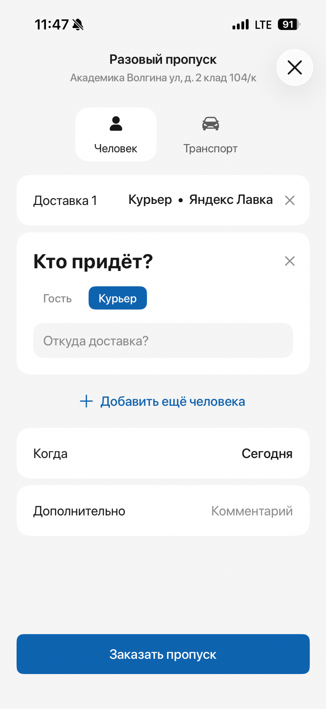
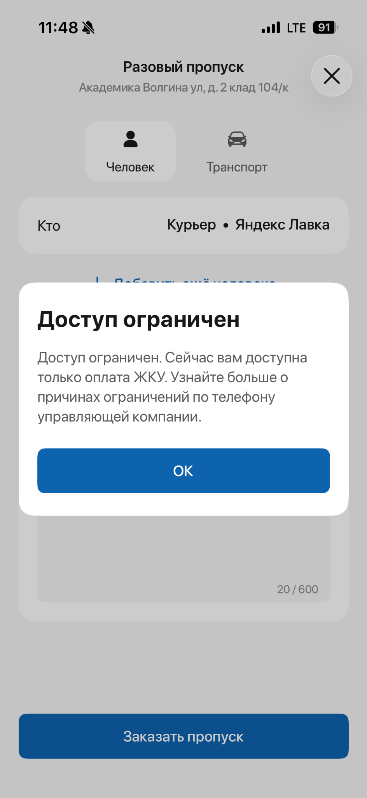
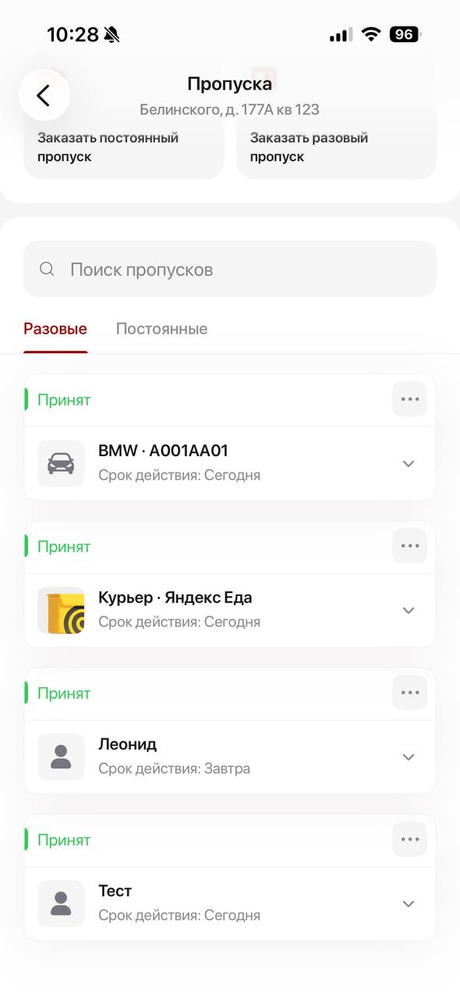
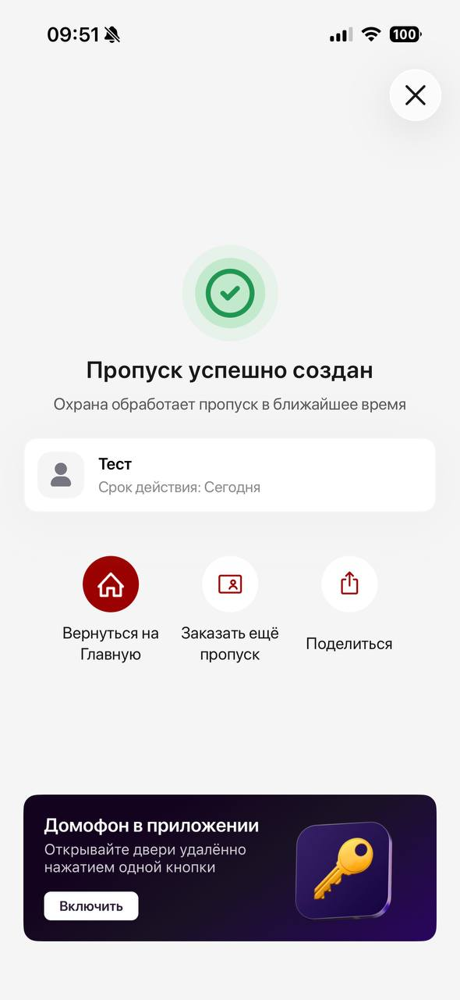
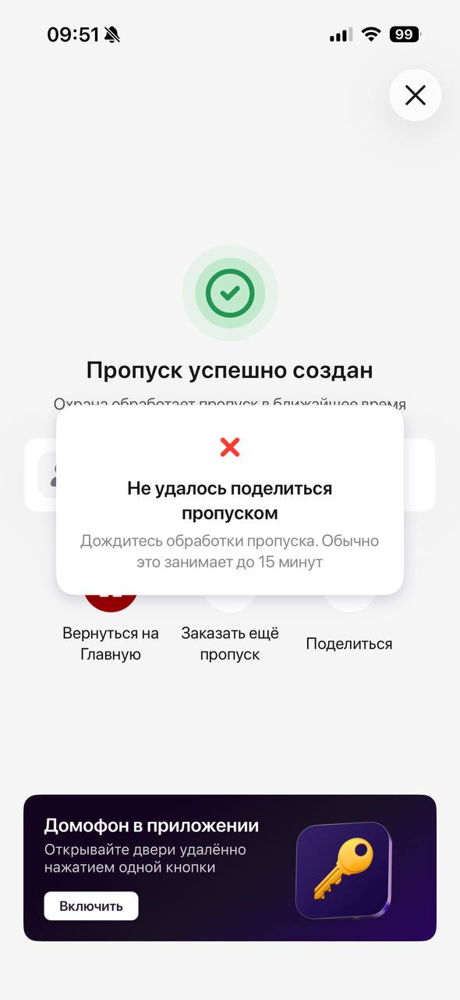
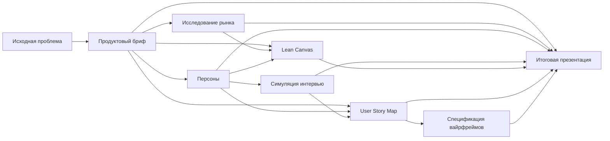

# Домиленд: новый сценарий разового пропуска

Продуктовый кейс о переработке сценария заказа разового пропуска в приложении
жителя. Проект охватывает путь от исходной пользовательской проблемы до
проверяемой концепции, требований к MVP и плана пилота в ЖК «Архитектор».

## Ключевая идея

Житель не обязан разбираться во внутренних типах пропусков и регламентах
управляющей компании. После оформления он должен заранее понимать:

- пропустят ли посетителя;
- разрешён ли въезд автомобиля;
- где и когда возможен доступ;
- нужно ли встречать гостя или курьера;
- что делать при ограничении или расхождении с охраной.

Продукт не гарантирует, что гость или курьер приедет. Он отвечает за другую
часть результата: применить актуальные правила ЖК и дать всем участникам
одинаковое, понятное и исполнимое решение по доступу.

## Контрольный сценарий

Житель ожидает доставку материалов для ремонта. Курьер приезжает на крупном
автомобиле, который не может попасть в паркинг. В текущем сценарии:

- компании доставки может не быть в справочнике;
- человек и автомобиль оформляются отдельно;
- порядок разгрузки неизвестен;
- ограничение показывается после заполнения формы;
- сообщение об ограничении не даёт конкретного продолжения.

Scope проекта — все виды разовых пропусков. Первый пилот ограничен одним
объектом: ЖК «Архитектор».

## Главные продуктовые решения

1. Начинать с бытовой цели: гость, доставка, специалист или транспорт.
2. Проверять роль жителя и применимые ограничения до персональных данных.
3. Объединять человека, автомобиль, время и условия в один визит.
4. Разрешать отложенное уточнение неизвестных данных, если это допускает
   регламент.
5. Показывать не технический факт создания записи, а решение по доступу:
   статус, место, время, условия и следующее действие.
6. Давать посетителю ограниченную по данным и времени инструкцию.
7. Обеспечивать единый статус для приложения и охраны и безопасный резервный
   сценарий при расхождении.

## Артефакты проекта

| Артефакт | Что внутри |
|---|---|
| [Продуктовый бриф](docs/one-time-pass-product-brief.md) | Проблема, Job Story, scope, подтверждённые наблюдения, метрики и критерии приёмки |
| [Исследование рынка](docs/one-time-pass-market-research.md) | Конкуренты, заменители, тренды, TAM/SAM/SOM, риски и 25 источников |
| [Персоны](docs/one-time-pass-personas.md) | Основные, дополнительная, ранний пользователь и anti-persona |
| [Симуляция интервью](docs/one-time-pass-persona-interview.md) | Проверка проблемы, ценности, доверия и незакрытых возражений |
| [Lean Canvas](docs/one-time-pass-lean-canvas.md) | Бизнес-модель, North Star, экономика и наиболее рискованные гипотезы |
| [User Story Map](docs/one-time-pass-user-story-map.md) | Backbone, модель состояний, истории, walking skeleton и релизная стратегия |
| [Спецификация вайрфреймов](docs/one-time-pass-wireframe-spec.md) | Пять мобильных экранов, ожидание решения, переходы и сценарии тестирования |
| [Итоговая презентация](docs/one-time-pass-product-summary.pptx) | Обобщающая продуктовая история и решение по пилоту |
| [Итоговая презентация в PDF](docs/one-time-pass-product-summary.pdf) | Версия презентации для быстрого просмотра |

## Скриншоты исследования

Первичное наблюдение зафиксировало поиск компании, форму разового пропуска и
позднее ограничение:

| Компания доставки | Форма пропуска | Ограничение доступа |
|---|---|---|
|  |  |  |

Расширенное тестирование 28 июля 2026 позволило завершить оформление и увидеть
состояния после отправки:

| Список пропусков | Ожидание решения | Передача недоступна | Компания не найдена |
|---|---|---|---|
|  |  |  |  |

Полный индекс 14 изображений и ограничения наблюдения находятся в
[описании папки screenshots](screenshots/README.md).

## Как устроен процесс



Каждый документ является самостоятельным артефактом и одновременно входом для
следующего этапа. Недостающие данные не маскируются под факты: они отмечаются
как `[assumption]` и переводятся в гипотезы для проверки.

## Наследование продуктовых скиллов

Проект создан с переиспользованием публичного набора
[`yngchefcook/product_skills`](https://github.com/yngchefcook/product_skills).
Методология, шаблоны выходов и последовательность работы наследуются от
upstream-репозитория; предметная область, исследование, решения и итоговые
артефакты относятся к этому кейсу.

Использованные скиллы:

| Скилл | Роль в проекте | Результат |
|---|---|---|
| `brief-writing` | Превращает исходную ситуацию в проверяемую продуктовую задачу | Бриф |
| `market-research` | Сопоставляет российские и международные подходы | Исследование рынка |
| `persona-generation` | Формирует рабочие пользовательские сегменты | Персоны |
| `persona-interview` | Симулирует возражения и проверяет слабые места концепции | Отчёт интервью |
| `lean-canvas` | Собирает ценность, жизнеспособность и экономические гипотезы | Lean Canvas |
| `user-story-mapping` | Переводит концепцию в путь, эпики и релизные срезы | User Story Map |
| `wireframe-spec` | Описывает экраны, состояния и переходы без преждевременного UI-дизайна | Вайрфреймы |
| `presentation-code-interpreter` | Собирает и проверяет итоговый PPTX | Презентация |

### Почему скиллы можно переиспользовать

- У каждого скилла есть определённый вход и ожидаемый выход.
- Артефакты связаны файлами, а не контекстом одного длинного чата.
- Общая предметная модель наследуется из брифа и не переопределяется на каждом
  этапе.
- Факты, выводы и допущения явно разделены.
- Любой этап можно повторить после появления новых данных, не пересобирая весь
  проект вручную.
- Пайплайн подходит не только для пропусков: его можно повторить для другого
  сервиса жителя, B2B2C-функции или нового цифрового продукта.

## Как подключить скиллы

Сами upstream-скиллы не включены в этот репозиторий. Подключите их локально:

```bash
git clone https://github.com/yngchefcook/product_skills.git product_skills-main
mkdir -p .agents/skills

for skill in \
  brief-writing \
  market-research \
  persona-generation \
  persona-interview \
  lean-canvas \
  user-story-mapping \
  wireframe-spec \
  presentation-code-interpreter
do
  ln -s "../../product_skills-main/$skill" ".agents/skills/$skill"
done
```

После подключения перезапустите используемую среду, чтобы она перечитала
каталог скиллов.
Скилл презентаций использует дополнительные файлы из своей папки
`code_interpreter`, поэтому его нужно подключать целиком, а не только
`SKILL.md`.

### Минимальный повторяемый пайплайн

```text
brief-writing
    → persona-generation
    → user-story-mapping
    → wireframe-spec
```

### Полный пайплайн

```text
brief
    → market + personas
    → persona interview
    → lean canvas + user story map
    → wireframes
    → summary presentation
```

На каждом шаге передавайте ссылки на созданные Markdown-файлы как вход
следующего скилла. Это сохраняет проверяемость и позволяет человеку менять
отдельные решения между этапами.

## Главный риск и условия пилота

Главный риск находится не в интерфейсе. Приложение не сможет показать
исполняемый результат, если УК и охрана не согласовали:

- виды разовых визитов;
- обязательные и отложенные данные;
- правила прохода, въезда и разгрузки;
- ролевые и административные ограничения;
- изменение и отмену визита;
- единый статус и резервный сценарий при расхождении.

Поэтому пилот должен проверять не только четыре экрана, но и полный
операционный контур на стороне жителя и поста охраны.

## Предварительные критерии успеха

- рост самостоятельно оформленных допустимых визитов — не менее 20%;
- снижение незавершённых оформлений — не менее 30%;
- снижение медианного времени оформления — не менее 25%;
- снижение обращений в УК — не менее 30%;
- отсутствие ухудшения показателей безопасности и ручной работы охраны.

Все значения предварительные и должны быть пересмотрены после получения
исходной аналитики.

## Ограничения

- Исследование рынка кабинетное и не заменяет полевые интервью.
- Персоны и интервью содержат гипотезы, а не подтверждённые профили.
- Коммерческая модель функции не рассчитана без внутренних данных Домиленда.
- Правовая допустимость отдельных административных ограничений требует
  отдельной экспертизы.
- Масштабирование на другие ЖК находится за пределами пилота.

## Атрибуция и лицензирование

- Источник продуктовых скиллов:
  [`yngchefcook/product_skills`](https://github.com/yngchefcook/product_skills).
- Скиллы не скопированы в этот репозиторий и устанавливаются отдельно.
- В локальном snapshot upstream-репозитория на момент подготовки проекта не
  обнаружен файл `LICENSE`. Перед копированием, изменением или распространением
  исходных скиллов необходимо проверить актуальные условия у автора.
- Этот проект не предоставляет дополнительную лицензию на upstream-материалы.

## Конфиденциальность

Исходные скриншоты интерфейса включены в репозиторий по решению автора проекта.
Они содержат адресные и другие контекстные данные. Перед переводом репозитория
в публичный режим стоит повторно проверить скриншоты и документы на
персональные данные, а также согласовать использование названий Домиленд и
ЖК «Архитектор».
